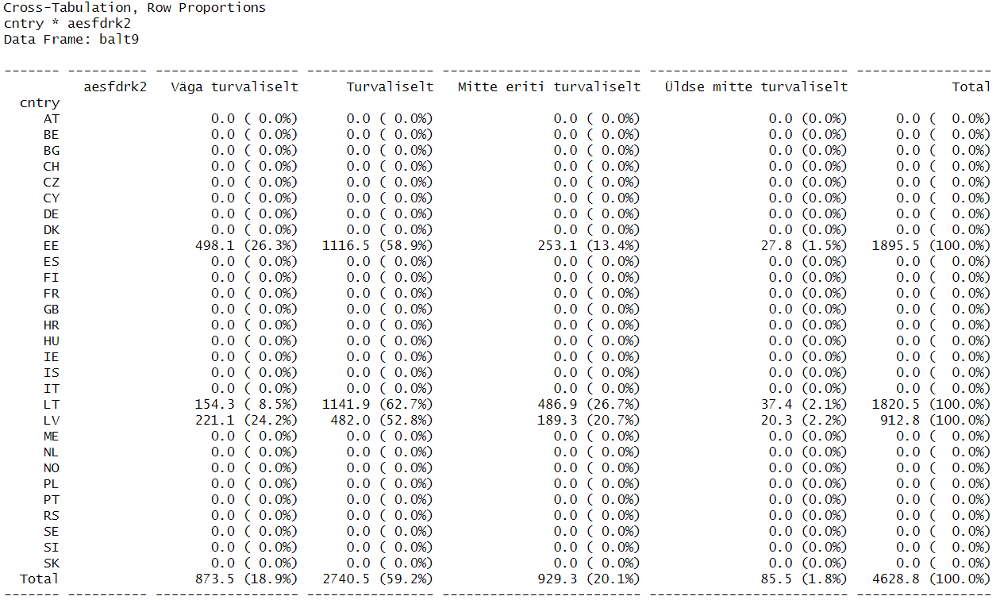

Laeme sisse tööks vajalikud paketid.

```{r message = FALSE, warning = FALSE}
library(haven)
library(tidyverse)
library(summarytools)
```

## Ülesanne 2.1

::: {.panel-tabset}

### Ülesanne

Laadige sisse Moodle's olev andmestik `demo.csv`. Kasutage selleks funktsiooni `read.csv` (mitte `read.csv2`, sest andmestikus on eri lahtrites olevad väärtused eraldatud komadega, mitte semikoolonitega -- selles saab veenduda, avades andmestiku Notepad'is vms kõige lihtsamas tekstiredaktoris). Allolev käsk töötab juhul, kui teil on projekti kaustas kaust `data` ja andmefail selle sees ning RStudios avatud selle projekti aken.

```{r}
demo <- read.csv("data/demo.csv")
```

Tutvuge andmestikuga. Millised tunnused on andmestikus ja mida nad võiksid mõõta? Mis üksuse põhine on andmestik ehk millise üksuse andmed on ridades?

Funktsiooniga `summarise` saame arvutada erinevaid kokkuvõtvaid näitajaid tunnuste kohta, nagu näiteks summa (funktsioon `sum`) või aritmeetiline keskmine (funktsioon `mean`) jms. Kui soovime neid näitajaid mingite gruppide kohta, peame andmestiku eelnevalt grupeerima funktsiooniga `group_by`. Alloleva käsuga arvutatakse tunnuse `syndide_arv` summa maakonniti ehk saadakse sündide arv iga maakonna kohta.

```{r}
demo %>% 
  group_by(maakond) %>% 
  summarise(syndide_arv = sum(syndide_arv))
```

Proovige arvutada surmade arv maakonniti.

### Vihje

Andmestikust saab kõige lihtsamini ülevaate funktsiooniga `View`, aga võib kasutada ka funktsiooni `str`, `head` vms.

Surmade arvutamise käsk ilmselt ei tööta. Mis võib olla probleem? Kas veateade võiks anda selle kohta mingi vihje? Mõtle natuke, vaata seejärel lahenduse paani ja liigu siis edasi ülesande 2.2 juurde.

### Lahendus

Tunnuste nimed andmestikus ja väärtused esimestel ridadel:

```{r}
head(demo)
```

Nagu saadud tabelist on näha, on andmestikus andmed kohalike omavalitsuste kohta: KOV-i nimi, sealne rahvaarv, maakond, kuhu KOV kuulub, sündide arv ja surnute arv. Arvud kahes viimases tunnuses võivad vihjata, et sündide ja surnute arv on mingi aasta kohta. Mis aasta kohta, seda kuskilt välja lugeda ei saa, ütlen siinkohal ära, et andmed on 2023. aasta kohta.

Kui püüate sündide arvu eeskujul surnute arvu tunnuse väärtuseid kokku liita, siis see ei õnnestu:

```{r error = TRUE}
demo %>% 
  group_by(maakond) %>% 
  summarise(surmade_arv = sum(surnute_arv))
```

Ülesanne oligi nii mõeldud, harjutamaks läbi olukorda, kus saame sellises olukorras veateate. Mida see veateade tahab meile öelda? Kui sul on mingi mõte selles osas tekkinud, liigu edasi teise ülesande juurde.

:::

## Ülesanne 2.2

::: {.panel-tabset}

### Ülesanne

Tundub, et probleem on tunnuse tüübiga. Kuidas võiks täpsemalt jälile saada, millest probleem tekib?

### Vihje

Abiks võiks olla funktsioon `class` või `typeof`. Tuleta praktikumieelse materjali põhjal meelde, mida need funktsioonid teevad ja kuidas neid kasutada, seejärel rakenda uuritavatele tunnustele.

### Vihje

Millest võib see tulla, et tunnus `surnute_arv` on teksti tüüpi? Uuri lähemalt selles tunnuses olevaid väärtuseid.

### Vihje

Kui said jälile, millises väärtuses on probleem, mõtle, millisest funktsioonist võiks olla abi, et tunnus muuta arvuliseks. Mis juhtub seejuures vigase väärtusega selles tunnuses?

### Vihje

Abi võib olla funktsioonist `as.numeric`. See ei ole siiski parim lahendus, parem oleks nt kasutada funktsiooni `case_when` või `ifelse` (see funktsioon on sarnane Exceli funktsioonile IF) vms.

### Lahendus

Saadud veateates viitab esimene pool

```{r eval = FALSE}
Error in `summarise()`:
ℹ In argument: `surmade_arv = sum(surnute_arv)`.
ℹ In group 1: `maakond = "Harjumaa"`.
```

sellele, et viga tekib `summarise`-käsus selle argumendi käsitlemisel, millega summeeritakse tunnuse `surnute_arv` väärtuseid. See ei tähenda siiski veel, et käsk ise on vigaselt kirja pandud või et tuleks käsku muuta, probleem võib olla ka andmetes, mis on käsus tehtavate arvutuste aluseks. Kuna eelnevalt grupeeritakse andmed tunnuse `maakond` järgi, siis antakse ka teada, viga tekib esmalt siis, kui käsitletakse Harjumaa andmeid, aga see ei anna olulist infot juurde -- see ei tähenda antud juhul, et Harjumaa andmed on vigased, lihtsalt andmestikus on esimesel real ühe Harjumaa KOV-i andmed.

```{r eval = FALSE}
Caused by error in `sum()`:
! invalid 'type' (character) of argument
```

Teine pool veateatest annab juba rohkem infot -- probleem on selles, et käsitletav tunnus on teksti tüüpi (*character*), samas kui väärtuste summeerimiseks peaksid need olema arvulised. Probleemi olemasolu kinnitab ka järgnev käsk.

```{r}
class(demo$surnute_arv)
```

Milles on probleem täpsemalt? Kui vaatate käsuga `View(demo)` andmestiku sisu, siis tunnuses `surnute_arv` ilmselt (vähemalt esialgu) midagi kahtlast silma ei hakka -- tunnuse väärtused on ju arvude moodi. Et tunnus on tekstitüüpi, näitab küll see, et "arvud" on selles tunnuses joondunud lahtrite vasakusse serva, samas kui arvulised väärtused oleksid joondatud paremasse serva (samasugune eristus esineb ka Excelis). Tuletagem jälle praktikumieelsest materjalist meelde, et erinevat tüüpi väärtuste esinemisel tunnuses antakse R-s kogu tunnusele n-ö üldisem tüüp, seega arvude ja tekstiliste väärtuste koos esinemisel käsitletakse kõiki väärtuseid tunnuses tekstina. Kui lähemalt tunnuses olevaid väärtuseid silmitseda, ilmneb, et Alutaguse valla puhul on surnute arv "89,0" -- see ei ole tavaline murdarv, sest R-s on vaikeseadena murdarvud punktiga, mitte komaga. Kui arvus esineb koma, ei ole see R-i jaoks arv, vaid tekst. Selle tõttu käsitletakse ka kõiki tunnuses olevaid väärtuseid automaatselt tekstina.

Kuidas saada tekstiline tunnus arvuliseks? Praktikumieelsest materjalist tuleb ehk meelde, et selleks saab kasutada funktsiooni `as.numeric`. Kasutades `dplyr`'i võimalusi, saaksime tunnust muuta funktsiooni `mutate` abil:

```{r}
demo_as_num <- demo %>% 
  mutate(surnute_arv = as.numeric(surnute_arv))
```

Saadud ohuteade annab märku, et tunnuse tüübi muutmisel tekkis tunnusesse andmelünki (NAs). Vaatame, milline väärtus nüüd Alutaguse vallal surnute arvu tunnuses on:

```{r}
demo_as_num %>% 
  filter(kov == "Alutaguse vald")
```

Nüüd ongi tunnuses `NA`, mis ei ole tekstiline väärtus, vaid tähistab andmelünka ehk väärtuse puudumist (*Not Available*), Excelis oleks selline lahter lihtsalt tühi. Kui sellisel juhul arvutaksime surnute arvu maakonniti, saaksime küll arvutused muude maakondade puhul tehtud, aga kogu Ida-Virumaa surnute arvuks saaksime `NA`, sest kui mingid andmed on puudu, ei saa ka korrektset summat arvutada:

```{r}
demo_as_num %>% 
  group_by(maakond) %>% 
  summarise(surmade_arv = sum(surnute_arv))
```

Võime küll andmelünga arvutustest välja jätta, lisades funktsiooni `sum` argumendiks `na.rm = TRUE`, aga see ei oleks siiski korrektne tulemus, sest alahindaks mõnevõrra surmade arvu kogu Ida-Virumaal:

```{r}
demo_as_num %>% 
  group_by(maakond) %>% 
  summarise(surmade_arv = sum(surnute_arv, na.rm = TRUE))
```

Ilmselt võime eeldada, et Alutaguse valla algne väärtus surnute arvu tunnuses "89,0" tähendas väärtust 89. Seega saaksime praeguse `NA` asendada ise väärtusega 89. Kuidas seda teha? Saaksime näiteks seada tingimuse: kui tegu on Alutaguse vallaga, siis muudame vastaval real tunnuse `surnute_arv` väärtuseks 89, kui tegu ei ole Alutaguse vallaga, jäävad väärtused samaks. Selleks saab kasutada erinevaid funktsioone, nt `case_when` või antud juhul sobiks ka `case_match`, aga saab ka kasutada eelnevalt vihjatud funktsiooni `ifelse`, mis töötab samamoodi nagu funktsioon IF Excelis: kolm argumenti, millest esimene on tingimus, teisega seadistame, mis saab siis, kui tingimus on täidetud, ja kolmandaga, mis saab siis, kui tingimus ei ole täidetud. 

Nagu ikka, kui soovime mingit tunnust `data frame`'is muuta, saame selleks kasutada funktsiooni `mutate`. Muudame sealjuures kogu tunnuse `surnute_arv` arvuliseks tunnuseks, sest tekstilisse tunnusesse Alutaguse vallale väärtust 89 omistades muutuks seegi muidu tekstiliseks väärtuseks. 

```{r}
demo_parandatud <- demo %>% 
  mutate(surnute_arv = as.numeric(surnute_arv),
         surnute_arv = ifelse(kov == "Alutaguse vald", 89, surnute_arv))
```

Alternatiiv oleks kasutada näiteks funktsiooni `case_when`:

```{r}
demo_parandatud <- demo %>% 
  mutate(surnute_arv = case_when(kov == "Alutaguse vald" ~ 89, 
                                 .default = as.numeric(surnute_arv)))
```

Kontrolliks:

```{r}
demo_parandatud %>% 
  filter(kov == "Alutaguse vald")
```

:::

## Ülesanne 2.3

:::{.panel-tabset}

### Ülesanne

Kui said tunnuse `surnute_arv` korda, koosta ka ülesandes 2.1 nõutud tabel.

### Vihje

Lahenduseks tuleb ülesandes 2.1 antud näite koodis asendada lihtsalt andmestiku ja tunnuste nimed.

### Vihje

```{r eval = FALSE}
______________ %>% 
  group_by(maakond) %>% 
  summarise(surmade_arv = sum(______________))
```

### Tulemus

```{r echo = FALSE}
demo_parandatud %>% 
  group_by(maakond) %>% 
  summarise(surmade_arv = sum(surnute_arv))
```

:::

## Ülesanne 2.4

::: {.panel-tabset}

### Ülesanne 

Laeme sisse tööks vajalikud andmed, need on samad Euroopa Sotsiaaluuringu 9. küsitluslaine andmed aastast 2018, mis praktikumieelsetes materjalides.

```{r}
r9 <- read_spss("data/ESS9e03_1.sav")
```

Töötame natuke tunnusega `aesfdrk`, kus on vastused küsimusele, kui turvaliselt tunneb respondent end, jalutades üksinda oma kodu ümbruses pimedal ajal, kas väga turvaliselt, turvaliselt, mitte eriti turvaliselt või üldse mitte turvaliselt. 

Enne tunnuse sisulist analüüsimist muutke palun tunnuses `aesfdrk` arvulised väärtused sõnalisteks. Kuna teeme algandmestikust erinevaid alaandmestikke, siis mõttekas on tunnusele lisada sõnalised väärtused juba algandmestikus `r9`. Selleks on võimalik kasutada nii andmestikus olemasolevaid ingliskeelseid märgendeid kui ümber kodeerida tunnus eestikeelseks. Proovige teist varianti -- esimene on küll lihtsam, aga tihtipeale, kui meil on vaja näiteks esitada analüüsitulemusi eestikeelsele auditooriumile, on tarvis ka tunnuste sisu eestikeelseks muuta.

Nagu ikka küsitlusandmete puhul, on sisulise tõlgenduse korrektsuse huvides mõttekas järgi vaadata küsimuse ja skaala täpne eestikeelne sõnastus (see ei pruugi olla sama, mis ise inglise keelest tõlkides, sest ankeedi tõlkimine on üsna peen töö oma metoodikaga). Euroopa Sotsiaaluuringu eestikeelse ankeedi leiate [ESS-i lehelt](https://www.europeansocialsurvey.org/) *Data* => *ESS Data Portal* => *ESS Round 9 - 2018* => *ESS 9 - Study Documentation* => *Country Documentation* => *Estonia* => *ESS9 Questionnaires (EE)*. Mis järjekorranumbriga on see küsimus ankeedis, saate teada, kui otsite tunnuse `aesfdrk` info üles 9. laine koodiraamatust: *Data Portal* => *ESS Round 9 - 2018* => *ESS 9 - Study Documentation* => *ESS9 Appendix A7 Codebook ed. 3.1*.

Pärast ümberkodeerimist kontrollige, kas ümberkodeerimine sai õigesti tehtud (kas tulemus on korrektne).

### Vihje

Et veenduda, millised on kategooriate koodid ja nimetused andmestikus, saab kasutada funktsiooni `distinct` või `count`. Tunnuse väärtuste ümberkodeerimiseks saab kasutada paketi `dplyr` funktsiooni `case_match`. Saab kasutada ka sama paketi funktsiooni `case_when`, aga kuna tegu on sisuliselt kategoriaalse tunnusega, on `case_match` siinkohal lihtsam variant. Et kontrollida, kas ümberkodeerimine töötab õigesti, saate teha sagedustabeli enne ja pärast ümberkodeerimist.

### Vihje 2

Selleks, et tunnuse kategooriate järjestus jääks samas, mis algtunnuses, saab algtunnuse ümberkodeerimisel muuta faktortunnuseks `case_match` argumendi `.ptype` ja funktsiooni `factor` abil.

### Vihje 3

Ümberkodeerimise õigsust saab kontrollida nt funktsiooniga `count`.

### Tulemus

Enne ümberkodeerimist võiks veenduda, mis väärtused tunnuses esinevad (alternatiivina allolevale tabelile võib teha ka tunnuse sagedusjaotuse).

```{r aesfdrk_distinct, echo = FALSE}
r9 %>% 
  distinct(aesfdrk)
```

Kontrollime, kas ümberkodeerimine töötas õigesti.

```{r aesfdrk_case_match, echo = FALSE}
r9 <- r9 %>% 
  mutate(aesfdrk2 = case_match(aesfdrk,
                          1 ~ "Väga turvaliselt",
                          2 ~ "Turvaliselt",
                          3 ~ "Mitte eriti turvaliselt",
                          4 ~ "Üldse mitte turvaliselt",
                          .ptype = factor(levels = c("Väga turvaliselt",
                                                     "Turvaliselt",
                                                     "Mitte eriti turvaliselt",
                                                     "Üldse mitte turvaliselt"))))
r9 %>% 
  count(aesfdrk, aesfdrk2)
```

:::

## Ülesanne 2.5

::: {.panel-tabset}

### Küsimus

Kui suur osa Eesti vastajatest arvas, et tunneksid end pimedal ajal kodu ümbruses jalutades väga turvaliselt? Kui suur osa tunneb end üldse mitte turvaliselt? Kasutage funktsiooni `count`, arvutage ka protsentjaotus. Tehke siin ja edaspidi arvutused andmeid kaaludes.

### Vihje

Küsimusele saab vastata, eraldades algandmestikust Eesti andmed ja koostades tunnuse `aesfdrk` jaotuse. 
Kasutades selleks funktsiooni `count`, läheb protsentjaotuse arvutamiseks vaja funktsiooni `mutate`.

### Vihje 2

```{r eval = FALSE}
ee9 <- r9 %>% 
  filter(________ == "__")

ee9 %>% 
  count(________, wt = ________) %>% 
  mutate(protsent = __ / sum(__) * 100)
```

Kui soovime andmelünkade sageduse tabelist välja jätta, saame lisada funktsiooni `drop_na`.

```{r eval = FALSE}
ee9 %>% 
  drop_na(________) %>% 
  count(________, wt = ________) %>% 
  mutate(protsent = __ / sum(__) * 100)
```


### Tulemus

```{r echo = FALSE}
ee9 <- r9 %>% 
  filter(cntry == "EE")

ee9 %>% 
  count(aesfdrk2, wt = pspwght) %>% 
  mutate(protsent = n / sum(n) * 100)
```

Kui soovime andmelünkade sageduse tabelist välja jätta, saame järgneva tabeli.

```{r echo = FALSE}
ee9 %>% 
  drop_na(aesfdrk2) %>% 
  count(aesfdrk2, wt = pspwght) %>% 
  mutate(protsent = n / sum(n) * 100)
```

:::

## Ülesanne 2.6

::: {.panel-tabset}

### Küsimus

Millistes Eesti regioonides tuntakse end turvalisemalt, kus vähem turvaliselt? Kõige ülevaatlikum oleks sellele küsimusele vastata risttabeli alusel. Kuidas peaksite risttabelis protsendid seadistama, et küsimusele oleks kõige lihtsam vastata? Proovige nii rea-, veeru- kui üldprotsente ja uurige, kuidas neid oleks õige tõlgendada, mida erinevad protsendid järeldada võimaldavad.

Kodeerige enne regiooni tunnus koodidest sõnalisteks väärtusteks. Kuna regiooni tunnuses on märgendid eestikeelsed, piisab siin funktsioonist `sjlabelled::as_label` (mõttekas oleks ka kirja panna argument `drop.levels = TRUE`).

Andmelünki on turvalisuse tunnuses väga vähe, jätke andmelünkade sagedused tabelist välja.

### Vihje

Risttabeli saab moodustada funktsiooniga `ctable` paketist `summarytools`. Protsente saab selle funktsiooni puhul seadistada argumendiga `prop`, andmelünki jaotustest välja jätta argumendiga `useNA`. Nende argumentide võimalikke väärtusi uurige vajadusel funktsiooni abifailist käsuga `?ctable`.

Kes jõudis praktikumieelse juhendmaterjali lõpust üle vaadata lisa risttabelite koostamise kohta paketiga `dplyr`, võib proovida lahendada ülesande `dplyr`'iga. Juhendmaterjalis ei olnud käsitletud seda, kuidas `dplyr`'iga koostada üldprotsentidega risttabelit. See on isegi lihtsam, sest jääb ära `group_by` käsk ja `count`-käsu argumentideks on nii rea- kui veerutunnus (ja kaalutunnus muidugi ka). Praktikas kasutatakse risttabelis üldprotsentide arvutamist harvem kui rea- või veeruprotsente, sest gruppide võrdlemine on üldprotsentide puhul keerulisem.

Teadmiseks: funktsiooniga `group_by` andmestiku grupeerimise järel muudetakse väljundtabel tavalisest *data frame*'ist *tibble* formaati, mis kuigi palju *data frame*'ist ei erine, aga erineb näiteks selle poolest, et konsoolis esitatakse tabelist vaikeseadena ainult esimesed kümme rida ja nii palju veerge, kui palju konsooli mahub. Üks võimalus *tibble*'i puhul rohkem veerge väljundisse saada on konsooliakent hiirega laiemaks vedada, teine on lisada käsu lõppu funktsioon `print` argumendiga `width`, mille väärtuseks lisada esitatavate veergude arv või siis `Inf`, kui soovime kuvada kõiki andmestiku veerge (esitatavate ridade arvu määramiseks on argument `n`).  

### Tulemus

Funktsiooniga `summarytools::ctable`

```{r echo = FALSE}
ee9 <- ee9 %>% 
  mutate(region2 = sjlabelled::as_label(region, drop.levels = TRUE))

ctable(ee9$region2, ee9$aesfdrk2, weight = ee9$pspwght, useNA = "no")

ctable(ee9$region2, ee9$aesfdrk2, weight = ee9$pspwght, prop = "c", useNA = "no")

ctable(ee9$region2, ee9$aesfdrk2, weight = ee9$pspwght, prop = "t", useNA = "no")
```

Paketiga `dplyr`

```{r echo = FALSE}
ee9 %>% 
  drop_na(aesfdrk2) %>% 
  group_by(region2) %>% 
  count(aesfdrk2, wt = pspwght) %>% 
  mutate(protsent = n / sum(n) * 100) %>% 
  select(-n) %>% 
  pivot_wider(names_from = aesfdrk2,
              values_from = protsent)

ee9 %>% 
  drop_na(aesfdrk2) %>% 
  group_by(aesfdrk2) %>% 
  count(region2, wt = pspwght) %>% 
  mutate(protsent = n / sum(n) * 100) %>% 
  select(-n) %>% 
  pivot_wider(names_from = aesfdrk2,
              values_from = protsent)

ee9 %>% 
  drop_na(aesfdrk2) %>% 
  count(region2, aesfdrk2, wt = pspwght) %>% 
  mutate(protsent = n / sum(n) * 100) %>% 
  select(-n) %>% 
  pivot_wider(names_from = aesfdrk2,
              values_from = protsent)
```

:::

## Ülesanne 2.7

:::{.panel-tabset}

### Küsimus

Kuidas hindavad oma kodukoha turvalisust Eesti, Läti ja Leedu elanikud? Millises riigis tuntakse end turvalisemalt, kus vähem turvaliselt? Mille poolest erinevad Eesti ja Leedu elanike turvalisuse hinnangute jaotused?

### Vihje

Kõiki ülesande lahendamiseks vajalikke funktsioone oleme täna eelnevalt juba kasutanud. Et saada risttabelisse ainult kolme riigi andmed, tuleb algandmestikust `r9` filtreerida välja ainult Balti riikide andmed. Seejärel saab teha risttabeli funktsiooniga `ctable`, võib muidugi kasutada ka funktsiooni `count`.

### Tulemus

```{r echo = FALSE}
balt9 <- r9 %>% 
  filter(cntry %in% c("EE", "LV", "LT"))

ctable(balt9$cntry, balt9$aesfdrk2, weights = balt9$pspwght, useNA = "no")
```

Kui eelneva lahenduse puhul saite väljundisse lisaks Eestile, Lätile ja Leedule ka teiste riikide read (kus on küll ainult nullid, sest objektis `balt9` teiste riikide vastajate andmeid pole) nagu alloleval pildil, 



siis nende elimineerimiseks saab siingi kasutada funktsiooni `as_label` paketist `sjlabelled`:

```{r eval = FALSE}
andmestiku_nimi <- andmestiku_nimi %>% 
  mutate(cntry2 = sjlabelled::as_label(cntry, drop.levels = TRUE),
         )
```

<!-- Kui on vaja riigi tunnusesse eestikeelseid nimesid, saab kasutada `sjlabelled::as_label` asemel funktsiooni `case_match`: -->

```{r echo = FALSE, eval = FALSE}
balt9 <- balt9 %>% 
  mutate(cntry2 = case_match(cntry,
                            "EE" ~ "Eesti",
                            "LT" ~ "Läti",
                            "LV" ~ "Leedu"))
```

<!-- Eestikeelsete riiginimedega veeruprotsentidega tabel funktsiooniga `ctable` -->

```{r echo = FALSE, eval = FALSE}
ctable(balt9$aesfdrk2, balt9$cntry2, weights = balt9$pspwght, useNA = "no", prop = "c")
```

Paketiga `dplyr`

```{r echo = FALSE}
balt9 %>% 
  drop_na(aesfdrk2) %>% 
  group_by(cntry) %>% 
  count(aesfdrk2, wt = pspwght) %>% 
  mutate(protsent = n / sum(n) * 100) %>% 
  select(-n) %>% 
  pivot_wider(names_from = cntry,
              values_from = protsent)
```

:::

## Ülesanne 2.8

::: {.panel-tabset}

### Küsimus

Võtame uuesti Eesti andmed. Praktikumieelsetes materjalides kasutasime tervisehinnangu tunnust. Uurige nüüd, kas hinnang oma tervisele on seotud turvalisuse hinnanguga ehk kas need Eesti elanikud, kes hindavad positiivsemalt oma tervist, näevad positiivsemalt ka turvalisuse olukorda oma elukohas. Väga halvaks on oma tervise hinnanud vähe inimesi, nende omakorda jaotamine turvalisuse hinnangute alusel ei annaks eriti usaldusväärset jaotust, seega võiks halva ja väga halva tervisehinnanguga indiviidid kodeerida kokku ühte kategooriasse.

Kui mingi seos kahe tunnuse vahel peaks ilmnema, kuidas seda sisuliselt mõtestada? Miks peaks need kaks hinnangut omavahel seotud olema? Kas saab eeldada põhjusliku seose olemasolu kahe tunnuse vahel (see, mida arvatakse ühe küsimuse osas, mõjutab hinnangut teises küsimuses)? Kas põhjusliku seose asemel on mõistuspärasem mingi alternatiivne seletus?

### Vihje

Ka käesolevas ülesandes kasutatavaid funktsioone oleme täna eelnevalt juba kasutanud.

### Tulemus

```{r echo = FALSE}
ee9 <- ee9 %>% 
  mutate(health3 = case_match(health, 
                          1 ~ "Väga hea", 
                          2 ~ "Hea", 
                          3 ~ "Rahuldav", 
                          c(4, 5) ~ "Halb või väga halb", 
                          .ptype = factor(levels = c("Väga hea", 
                                                     "Hea", 
                                                     "Rahuldav", 
                                                     "Halb või väga halb"))))

ctable(ee9$aesfdrk2, ee9$health3, weights = ee9$pspwght, useNA = "no", prop = "c")
```

```{r echo = FALSE}
ee9 %>% 
  drop_na(aesfdrk2) %>% 
  group_by(health3) %>% 
  count(aesfdrk2, wt = pspwght) %>% 
  mutate(protsent = n / sum(n) * 100) %>% 
  select(-n) %>% 
  pivot_wider(names_from = health3,
              values_from = protsent)
```

:::

## Ülesanne 2.9

::: {.panel-tabset}

### Küsimus

Eelmises ülesandes ilmnenud seose üks seletus võiks olla, et kehvemalt hindavad oma tervis pigem vanemad inimesed ning võib-olla on ka vanematel inimestel rohkem hirme turvalisuse osas. Uurige, kas sellisel seletusel võiks olla tõepõhi all.

### Vihje

Üks võimalus seda kontrollida oleks kodeerida vanuse tunnus kategoriaalseks (nt viis kategooriat, uurige enne tunnuse `agea` kumulatiivse jaotuse põhjal, kuhu kategooriate piirid seada, et grupid oleksid enam-vähem ühesuurused) ja teha risttabel vanuse ja tervisehinnangu tunnustega ning risttabel vanuse ja turvalisuse hinnangu tunnustega. Kui mõlemast ilmneb seos, võib see seletus pädeda küll.

### Tulemus

Tunnuse `agea` kumulatiivne protsentjaotus (neljandas veerus) kategooriate võimalike piiride leidmiseks (siin ruumi kokkuhoiuks esitatud ainult kümme esimest rida)

```{r echo = FALSE}
ee9 %>% 
  count(agea, wt = pspwght) %>% 
  mutate(protsent = n / sum(n) * 100,
         kum_protsent = cumsum(protsent))
```

Risttabelid paketiga `summarytools`:

```{r echo = FALSE}
ee9 <- ee9 %>% 
  mutate(vanus = case_when(agea <= 30 ~ "15-30",
                           agea <= 45 ~ "31-45",
                           agea <= 60 ~ "46-60",
                           agea <= 75 ~ "61-75",
                           agea > 75 ~ "76+"))

ctable(ee9$vanus, ee9$health3, weights = ee9$pspwght, useNA = "no")
ctable(ee9$vanus, ee9$aesfdrk2, weights = ee9$pspwght, useNA = "no")
```

Risttabelid paketiga `dplyr`:

```{r echo = FALSE}
ee9 %>% 
  drop_na(health3) %>% 
  group_by(vanus) %>% 
  count(health3, wt = pspwght) %>% 
  mutate(protsent = n / sum(n) * 100) %>% 
  select(-n) %>% 
  pivot_wider(names_from = vanus,
              values_from = protsent)

ee9 %>% 
  drop_na(aesfdrk2) %>% 
  group_by(vanus) %>% 
  count(aesfdrk2, wt = pspwght) %>% 
  mutate(protsent = n / sum(n) * 100) %>% 
  select(-n) %>% 
  pivot_wider(names_from = vanus,
              values_from = protsent)
  
```

:::
